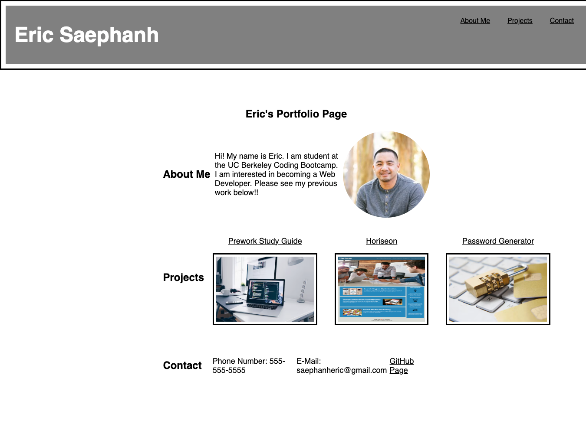

# my-portfolio-page
homework challenge 2. creating my portfolio page

## User Story
* I WANT to view a potential employee's deployed portfolio of work samples
* SO THAT I can review samples of their work and assess whether they're a good candidate for an open position

## Acceptance Criteria
* GIVEN I need to sample a potential employee's previous work
* WHEN I load their portfolio
* THEN I am presented with the developer's name, a recent photo or avatar, and links to sections about them, their work, and how to contact them
* WHEN I click one of the links in the navigation
* THEN the UI scrolls to the corresponding section
* WHEN I click on the link to the section about their work
* THEN the UI scrolls to a section with titled images of the developer's applications
* WHEN I am presented with the developer's first application
* THEN that application's image should be larger in size than the others
* WHEN I click on the images of the applications
* THEN I am taken to that deployed application
* WHEN I resize the page or view the site on various screens and devices
* THEN I am presented with a responsive layout that adapts to my viewport

## Actions Completed
* Created a basic portfolio webpage
* Titled, show's developer's name, recent photo, and links to sections for more info
* created links when clicked in the navigation, the UI scrolls to the corresponding section
* Created linked images when clicked, a new web page opens showing the app/webpage
* Delevoper's first project image is larger than others
* Responsive layout that adapts to viewport

## Page Link
https://saephanhe56.github.io/my-portfolio-page/

## Mock Up
